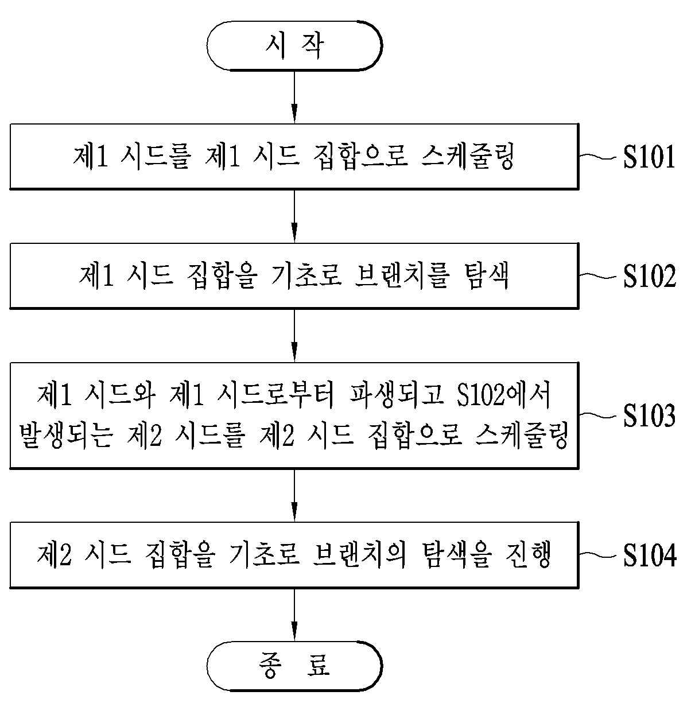

> 2018.11 ~ 2020.10  
> 국방과학연구소 (Agency for Defense Development)

국방과학연구소를 입사하고 약 3개월간의 준비기간을 거친 후, 처음으로 진행한 미래도전과제였다.  
대부분 현역연구원들로 이루어져 국방과학연구소 자체적으로 진행한 연구로 사이버기술센터(당시 2본부) 기준으로는 흔치 않은 자체 연구 과제였기 때문에
이런저런 행정적/성과적 시행착오도 있었으나 자체 개발 퍼저를 통해 5개의 CVE를 제보하는 등 괜찮은 결과물을 낸 과제.

## 과제 목표
과제는 퍼저를 개발하되, 이 과정에서 딥러닝을 활용하는 것을 최종 목표로 하였다.
그 말인 즉슨, 과제 성공을 달성하기 위해서는 무조건 "딥러닝"과 관련된 기술을 적용해서 "자체 퍼저"를 개발해야 한다는 것.

## 담당
과제는 총 3가지 파트로 나누어서 진행하였다.  
첫 번째는 "시드 변이", 두 번째는 "시드 스케줄링 알고리즘", 세 번째는 "시드 생성".  
이 중에 나는 시드 생성과 변이 파트에서 넘겨준 시드 파일들을 어떻게 활용할까를 고민하는 "시드 스케줄링 알고리즘" 파트를 담당하였다.
팀원들마다 각자 스케줄링 아이디어를 내었고, 결과적으로는
- 시드 파일 크기 순
- 새로운 브랜치를 발견한 시드 순
- 시드 파일 추가 순

등의 총 3가지 아이디어가 나왔으며, 이 모든 아이디어를 포괄적으로 수행하기 위해 "시드 집합(Seed set)" 개념을 도입하여
생성/변이된 시드 파일들을 모두 골고루 사용할 수 있도록 최종 알고리즘을 고안하였다. 

이외로도 과제를 진행하다가 팀원들이 타부대로 전출되는 상황이 나와서 어쩌다보니 Team Leader 타이틀을 달고
- 전체 코드 통합 및 수정
- 보고서 (기술적) 검수
- 최종발표 중 퍼저 시연

등의 업무를 수행하였다.

## 결과
과제는 다행히 성공적으로 끝났다. 총 7개의 CVE를 제출, 최종 5개가 인정되었으며 [특허](https://doi.org/10.8080/1020200102581)도 냈다.   
특허를 내는 과정 자체는 회사 자체에서 진행해주기 때문에 행정적 부담은 심하지 않았지만, 관련 기술을 변리사에게 설명하는 것은 온전히 내 몫이기 때문에
퍼징과 스케줄링을 모르는 사람에게 이를 자연어로 설명하기 위해 굉장한 사회적 노력을 들였다.  
이를 통해 겸사겸사 "쉽게 설명하기"의 중요성도 느꼈다.

## 느낀 점 + 아쉬운 점
아무래도 공공기관적 성격을 띄다보니 개발 자체 과정 앞뒤로 붙는 여러 행정적 절차가 있다.
과제 발표회라던가 중간보고, 과제 평가, 보고서 작성... 등등. 때문에 2년간 과제를 진행하면서
과제 진행 초기에는 분명 Cutting-edge 기술이었던 것이 과제가 종결될 때쯤 되면 "왜 이러저러한 최신기술은 적용시키지 않았나요?"
하는 질문을 받는 경우가 종종 있다.
아무래도 CS 분야 기술 발전 속도가 워낙 빠르다보니... 하지만 국가과제 특성상 과제계획서에 써놓은 기술을 사용하지 않으면 탈락사유가 되기 때문에
그 기술이 과제 종료 시점에는 최신 기술이 아닐지라도 꼭 적용시켜야 하는 문제점이 있다.
머리로는 이해하지만 연구하고 발전시킨 당사자 입장에서는 아쉬울 수 밖에 없는 상황.

또 이러한 류의 미래도전과제 진행이 국방과학연구소 입장에서도 처음이었기 때문에 산출물 내는데에 애를 좀 먹었다.
정확히는 과제의 최종 목표가 "퍼저 개발"이기 때문에 성능 입증을 위해 CVE를 찾고 인정받는 데에 주력을
그렇다보니 논문 쓸 생각만 하고 작업을 하지 못한 점이 아쉽. 최고까지는 아니더라도 괜찮은 곳에는 쓸 법하지 않을까 싶었다.

그래도 국가 과제가 어떤 흐름으로 흘러가는구나~ 하는 것을 체득했으니 다음 과제는 좀 더 잘 할 수 있겠다는 느낌을 얻었고
white box 기반으로 코드 자체적으로 딥러닝을 활용해서 취약점을 찾아보는것은 안될까 하는 아이디어를 얻었다.
개인 프로젝트로 해봐야겠다.