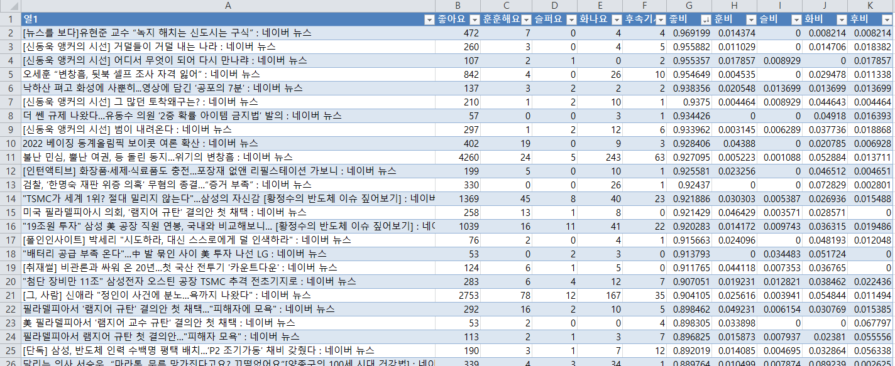
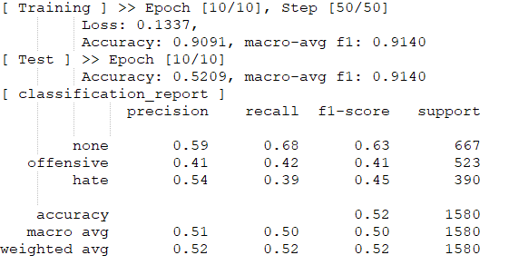
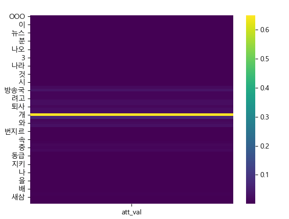

> 2020.12 ~ 2021.8  
> 논문 작성 가능성 탐색을 위한 개인연구 수행

머신러닝/딥러닝을 공부하기로 마음먹고 대학원 입학 후, NLP에 미래가 있다고 생각해서(그리고 재밌어보여서) NLP 관련 주제를 탐색했다. 
그 중에서 평소에 사회적 문제에도 관심이 많은 편이고, 특히 다년간의 인터넷 생활을 통해 toxic한 인터넷 문화에도 넌더리가 난터라
한국어 대상으로 Hate speech detection을 한 번 시도해보고 싶었다.

결과적으로 유의미한 성과는 내지 못하였으나 이론으로만 공부하다가 실제로 모델을 구현해보고, 처음으로 논문을 쓰기 위한 탐색을 수행해본 개인 프로젝트

## 프로젝트 목표
- 자연어 처리를 위한 모델에 익숙해지기
- 논문을 쓰기 위한 자료 탐색에 익숙해지기

## 관련 논문 리뷰/재현 
1. `ACL 2020` Contextualizing hate speech classifiers with post-hoc explanation
   - 현재 SOTA인 BERT 만을 이용해서는 hate speech detection이 그렇게 성능이 좋은 편이 아니다. (BLACK, JEWS 와 같은 word identifier에 과도하게 집중되기 때문)
   - 별개로 regularization을 적용해주어야 한다.
   - 논문에서는 [SOC explanation](https://openreview.net/pdf?id=BkxRRkSKwr) 활용
   
2. `SocialNLP 2020` BEEP! Korean Corpus of Online News Comments for Toxic Speech Detection [[link]](https://github.com/kocohub/korean-hate-speech)
   - 한국어 Dataset 구성하고 간단한 성능 테스트를 한 논문

3. `arxiv` HateBERT: Retraining BERT for Abusive Language Detection in English
   - BERT 전이학습을 해서 성능을 살펴보자
   - (결론) 전이학습은 효과적이다

4. `ACL 2019` NULI at SemEval-2019 Task 6: Transfer Learning for Offensive Language Detection using Bidirectional Transformers
5. `ACL 2019` Studying Generalisability Across Abusive Language Detection Datasets
   - 여러 Dataset에 대해 학습된 model을 cross-domain에 대해서 실험해보자
   - 생각보다 그렇게 Generalisability가 높게 나오지 않는다.
   - 사실 커뮤니티나 포털 사이트에 따라 "성향"이 존재하기 때문에 단어가 가지는 의미가 좀 다를 수 있기 때문. (즉 Dataset이 가지는 특성이 다를 수 있음)

6. `ACL 2016`Hateful Symbols or Hateful People? Predictive Features for Hate Speech Detection on Twitter
   - Dataset 논문
   
7. `ICWSM 2017` Automated Hate Speech Detection and the Problem of Offensive Language
    - Dataset 논문
    - hate speech / offensive / none 에 대한 명확한 정의를 내림.
8. `arxiv 2020` CRAB: Class Representation Attentive BERT for Hate Speech Identification in Social Media
    - BERT output을 추가로 가공하여 학습에 반영

9. `ALW 2020` The Effects of User Features on Twitter Hate Speech Detection
    - Hate speech detection에 쓸 수 있을만한 feature 찾는 데에 집중한 논문

10. `SocialNLP 2017` A Survey on Hate Speech Detection using Natural Language Processing
    - Hate speech detection에 대한 survey 논문
    - Feature: `N-gram`, `TF-IDF`, `LDA`, `embedding`, `sentiment analysis`, `lexical resources`, `linguistic features`, `knowledge-based features`, `meta-information`, `multimodal information`
    - Model: `SVM`, `RNN`, `CNN`, `BERT`
   
11. `arxiv 2020` To BAN or NOT to BAN: Bayesian Attention Networks for Reliable Hate Speech Detection
    - BERT + Monte carlo dropout

## 데이터셋 구성
네이버 뉴스 제목과 이에 대한 사람들의 반응을 통해 positive/negative 를 정의해 데이터셋으로 사용하고자 했다.
크롤링을 통해 한국어 데이터셋을 직접 구성하였다.
이 때, 정치성향에 따라 독자 반응이 극명하기 갈리는 경우가 많아서 연예/사회 쪽 기사만 크롤링했다.

## 난관 봉착
막상 "직접" 데이터셋을 구성하고 보니, 어떤 통찰이나 흐름, 패턴 등이 보이지 않았다.
기본적으로 내가 생각하는 AI란 "사람이 할 수 있는데(이게 꼭 대중일 필욘 없고, 전문가라고 해도) 시간이나 노력이 오래 들어가는 행위를 잘하는 도구"라고 생각하기 때문에
당장 Native Korean이자 인터넷 죽돌이인 내 눈에 패턴이 보이지 않는다면 AI도 크게 잘 하지 못할 거라 생각했다.
- 영어 기준이긴 하지만, 사람이 봐도 hate speech인지 아닌지 구분이 너무 어렵다. 문맥도 없이 문장 한 줄만으로는 의도 파악이 어렵다.
- 단순 욕설 등의 'offensive speech'가 아니라 'hate speech'를 구분해야 하는데, 사실 포털사이트 입장에서는 굳이 구분할 필요가 없다. 'offensive', 'hate' 모두 차단하는게 속 편하기 때문.

결국 흐름은 우리나라 기준으로 "인터넷 정화를 위한 노력"의 현황을 파악하는 리뷰를 시작했다.
겸사겸사 데이터셋 추가 확보도 하고.

## 다시 조사로...
1. 네이버 AI 클린봇
    - https://d2.naver.com/helloworld/7753273
    - (용도) 네이버 뉴스 댓글 관리. 욕설/비속어/모욕/선정적/폭력적/비하적 표현 등 탐지하여 블라인드 처리
    - (Dataset) 악플/애매/악플X => 35만개의 댓글 데이터셋
    - (Dataset preprocessing)
        - **음절** 단위로 분리
        - 오탈자 포함하여 많은 구어체 댓글을 분석
        - 데이터 불균형: 악플 데이터를 2배 정도 복사하여 균형을 맞춤
    - (모델) CNN + BiLSTM + LSTM (BERT 미사용)
        - 태스크가 단순함
        - 모델보다 데이터가 성능에 더 큰 영향을 미침
        - 무거운 모델일수록 업데이트를 위한 시간과 계산 비용이 크기 때문에 빠른 댓글 트렌드 변화를 잡기 어렵다
        - 최소이 응답 속도와 서비스 안정성이 보장되어야 함.
    - 전이학습 연구
        - 댓글 유사도 학습 (Persona Embedding)
            - 두 텍스트를 구성하고 있는 어휘가 얼마나 중복되는가?
            - 두 텍스트가 얼마나 의미적으로 유사한가? = 같은 사용자가 비슷한 시기에 비슷한 게시글에 대해 쓴 댓글은 유사하다.
        - ELMo

2. 넥슨 [[link]](http://ndcreplay.nexon.com/NDC2018/sessions/NDC2018_0033.html)
    - (용도) 게임 내 욕설 탐지
    - (Dataset) 게임 내 채팅데이터 -> 음절별 분리
    - (모델) CNN + Attention
    - (예시)  
   
   
3. 채팅 봇 서비스 심심이
    - Deep Bad Sentence Classifier (DBSC)
    - 따로 공개된 소스/논문/데이터셋 없음
4. BEEP! Korean Corpus of Online News Comments for Toxic Speech Detection [[link]](https://github.com/kocohub/korean-hate-speech) 
    - 약 8000개의 labeled dataset
    - (모델) BERT
        - CharCNN / BiLSTM 보다 높은 성능을 내었음.
5. `한국컴퓨터정보학회 2019` 딥러닝을 사용한 온라인 게임에서의 욕설 탐지
    - (Dataset) 게임 ‘ArcheAge’ 채팅 데이터 65000개
    - (모델) CNN
        - (음절 기반 / 글자 기반) 임베딩하면 결과 비교
6. `한국정보통신학회 2020` 딥러닝 기술을 활용한 차별 및 혐오 표현 탐지 : 어텐션 기반 다중 채널 CNN 모델링 [[link]](https://github.com/whjzsy/AMCNN)
    - (Dataset) BEEP! Korean Corpus of Online News Comments for Toxic Speech Detection
    - (모델) Word2vec + LSTM + Attention

결론적으로....
- 한국어 기준으로 혐오표현보다는 이를 포함한 보다 general한 offensive speech 모두를 검열하고 있음
- Dataset은 1인 고생해가며 직접 구성하지 말고 [BEEP](#다시-조사로) 논문을 인용하자
- 대부분의 모델은 CNN+LSTM 위주니까 일단 하나만 더해서 발전시켜보자
> 일단 간단하게 발전시켜서 `CNN + BiLSTM + Attention`를 수행해보자!

## 모델 구현 및 결과
이런저런 시행착오를 거쳐 모델을 재현하고, 새롭게 단장해내었으나 결과는 처참하였다.  

기껏 Attention까지 구현하였으니 이를 통한 분석도 수행해보았으나

대부분의 경우가 1~2개의 단어에 집중하는 경우가 많았다. 문제는 그 단어가 진짜 정답이랑 연관이 높은 경우도 있고 아닌 경우도 있었다는 것이다.
물론 최근 "Attention = explainable 은 아니다"라는 논문도 나오고 있긴 하지만 이 수준의 결과는 더 이상의 분석이 불가능하다고 판단했다.
 
결국 유의미한 성능 개선은 이루어내지 못하고 프로젝트를 마감하기로 결정하였다.

## 느낀 점 + 아쉬운 점
첫 논문 작업을 위한 여정이었다.
직장도 다니고 대학원 수업 들으면서 논문 조사하고 구현하고 등등 노력해보았으나, 8개월 간의 삽질이 진짜 삽질이 되어버려서 아쉬웠다.
그래도 당초 목적인 "딥러닝 모델에 익숙해지기(직접 논문 재현해보기)" 등은 달성했으니 마냥 시간을 날리진 않았다~ 하고 위안이나 삼을 수 밖에.
다음 논문 주제나 잘 찾아봐야겠다.